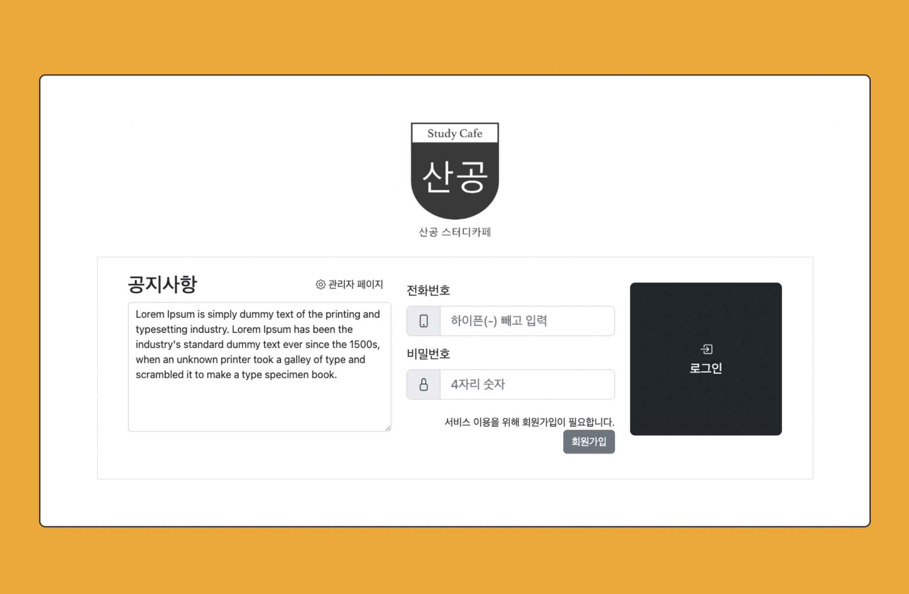
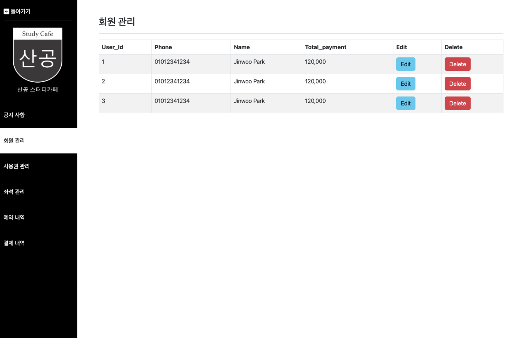

# study-cafe-kiosk

Kiosk program(Web) & server for study cafe

웹 기반의 스터디 카페 키오스크 프로그램 및 서버

## 목적

1. 스터디 카페 이용 및 운영의 전반적인 기능을 개발합니다.
2. 키오스크(웹) 조작을 통해 고객의 예약을 생성 및 관리합니다.
3. 비지니스 관리자를 위한 관리자 페이지를 개발합니다.

## 주요 기능
1. 예약 프로세스
2. 방(room)의 구분과 자리 위치 수정 등 전반적인 관리
3. 고객 및 이용권 관리

## TBC
[Convert to Node.js Server](https://github.com/Jinops/study-cafe-kiosk-2)
